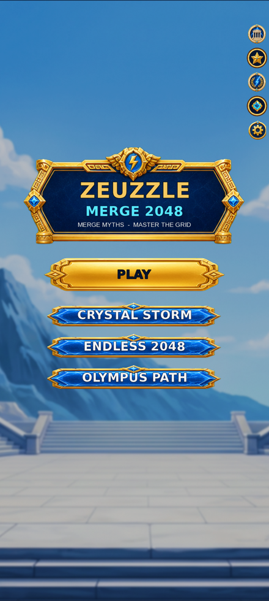
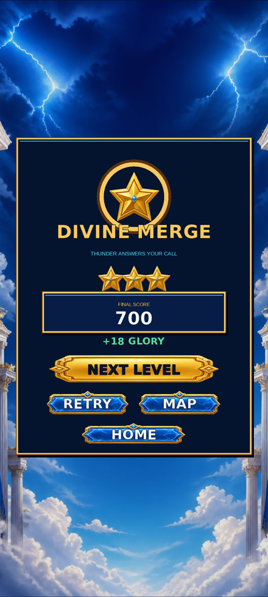
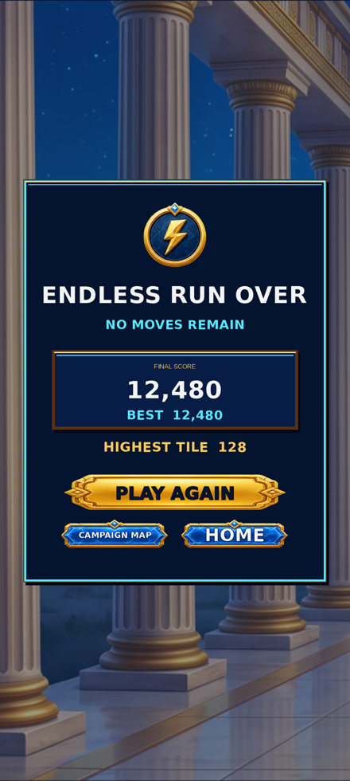
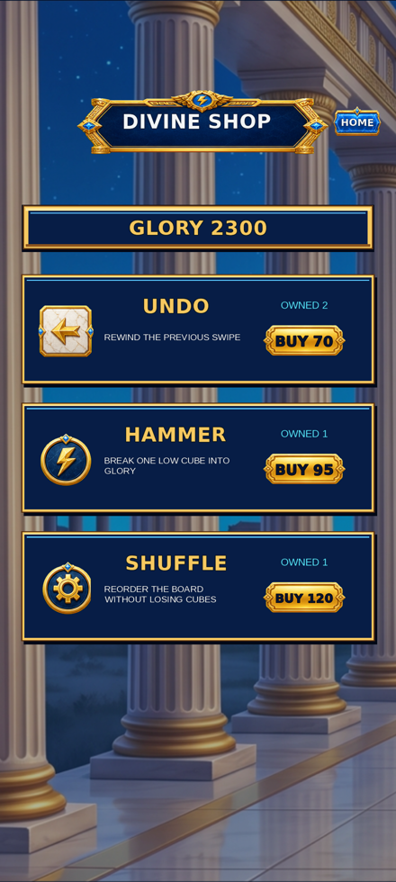

# Zeuzzle Merge 2048

A mythological merge puzzle that layers classic 2048 logic onto an Olympus setting, playable as a planned campaign, an untimed Endless mode, or a fast score-attack bonus game.

In the campaign, players plan each swipe carefully, merge matching crystals toward a target rune, and earn Glory, using Undo, Hammer and Shuffle to rescue an unstable board. Endless 2048 removes the move limit and runs until no combinations remain, while Crystal Storm is an endless score-attack mode where crystals, coins and dangerous Chaos Orbs fall at increasing speed and Zeus strikes with lightning from below — missing a crystal or hitting a Chaos Orb ends the run. Progress, per-mode high scores, rewards, a booster shop, achievements and daily gifts persist locally, wrapped in a marble-and-gold Greek visual style.

## Screenshots

<p align="center">
  
  
  
  
</p>

## Features

- Classic 2048 merge logic reskinned around Olympus crystals and runes, with a target-rune campaign objective
- Undo, Hammer and Shuffle recovery tools for rescuing an unstable board
- Endless 2048 mode with no move limit, playable until no merges remain
- Crystal Storm: an endless score-attack bonus mode with accelerating drops, Chaos Orb hazards and Zeus lightning strikes
- Per-mode persistent high scores, a booster shop, achievements and daily gifts
- Portrait Android runtime with an equivalent desktop QA window for fast iteration
- Fully offline — progress and rewards are stored only on the device

## Tech Stack

- **Language:** Kotlin
- **Platform:** Android (minSdk 24, targetSdk 36), plus an LWJGL3 desktop target for development
- **Engine / framework:** libGDX with Box2D physics
- **Build:** Gradle (Kotlin DSL), multi-module (`engine`, `core`, `android`, `lwjgl3`)

## Project Structure

```
engine/src/main/kotlin/.../thunderbound/engine/  # Merge/progress models and config
core/src/main/kotlin/.../thunderbound/core/      # Olympus Merge and Crystal Storm screens, game loop
android/                                          # Android launcher module (APK packaging)
lwjgl3/                                           # Desktop launcher for fast local iteration
design/                                           # Visual reference material
```

## Building

```bash
git clone https://github.com/brah1995u/zeuzzle.git
cd zeuzzle
./gradlew :android:assembleDebug
```

The APK lands in `android/build/outputs/apk/debug/`. For fast local iteration, `gradle :lwjgl3:run` launches the desktop build.

## Status

Playable slice: the pixel-faithful Olympus Merge presentation, swipe-based combo/score/Glory progression, undo/hammer/shuffle controls, and a full playable 30-second Crystal Storm bonus mode are implemented and running on both Android and desktop.
